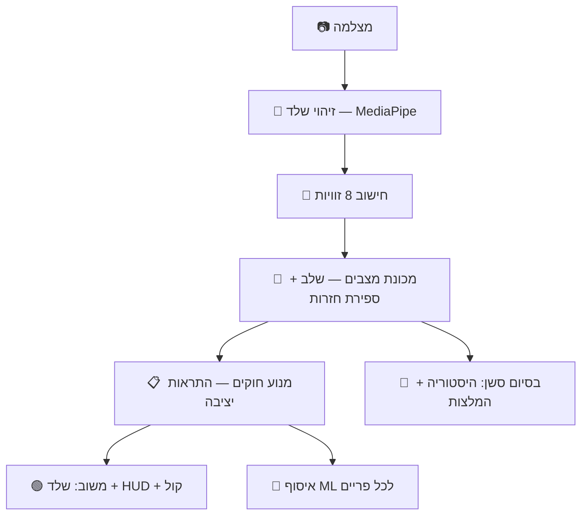
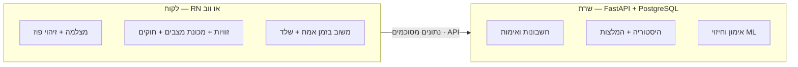

# Pose-IQ — מסמך סטטוס

> מסמך פנימי להכנה לפגישת חיתוך מצב עם המנחה · עודכן ביוני 2026
> (גרסת HTML מעוצבת ומוכנה להדפסה: `docs/pose-iq-status-he.html`)

Pose-IQ היא מערכת אימון כושר חכמה בזמן אמת. המצלמה מצלמת את המתאמן, המערכת מזהה את שלד הגוף, מודדת זוויות במפרקים, מזהה את שלב התרגיל וסופרת חזרות, נותנת משוב מיידי על טעויות יציבה (ויזואלי + קולי), שומרת היסטוריית אימונים ומפיקה המלצות מותאמות אישית. בנוסף נבנתה שכבת **למידת מכונה** שלומדת מסרטוני הדגמה, ולאחרונה נוספה **שכבת מסד נתונים** כהכנה למוצר רב-משתמשים.

---

## 1. סקירה כללית וסטאק טכנולוגי

כיום המערכת רצה כ**אפליקציית דסקטופ מקומית בפייתון**: נפתח חלון `OpenCV` שמציג את וידאו המצלמה עם שלד מצויר, מד-זוויות, מונה חזרות, רשימת מוכנוּת ותיבות שגיאה.

| תחום | טכנולוגיה |
|------|-----------|
| שפה | `Python 3.12` |
| ראייה ממוחשבת / מצלמה | `OpenCV` |
| זיהוי פוז (שלד) | `MediaPipe Pose Landmarker` (33 נקודות) |
| חישוב מספרי | `NumPy` |
| למידת מכונה | `scikit-learn`, `pandas`, `joblib` |
| משוב קולי | `pyttsx3` |
| מסד נתונים (חדש) | `SQLAlchemy` + `SQLite` (פיתוח) / `PostgreSQL` (ייצור) |

חמישה תרגילים: **סקוואט, פלאנק, לאנג', בייספ קרל, לחיצת כתפיים**. נמדדות **8 זוויות גוף**: ברך ימין/שמאל, מרפק ימין/שמאל, זרוע-גוף ימין/שמאל, גב (spine), פיסוק רגליים (legs_spread).

---

## 2. מבנה התיקיות והקבצים

**`core/detection/` — ראייה ממוחשבת**

| קובץ | תפקיד |
|------|-------|
| `camera_stream.py` | עטיפת מצלמה: פתיחה, קריאת פריימים, חישוב FPS. |
| `pose_detector.py` | טוען מודל MediaPipe (הורדה אוטומטית), מחזיר 33 נקודות שלד + נראוּת. |
| `angle_calculator.py` | הופך נקודות שלד ל-8 זוויות (חישוב זווית תלת-ממדית). |

**`core/exercise/` — מודל ולוגיקת מצב**

| קובץ | תפקיד |
|------|-------|
| `exercise_model.py` | טוען הגדרות תרגילים מ-`exercises.json`; כולל `match_phase` לשחזור. |
| `exercise_state_machine.py` | בדיקת מוכנוּת, זיהוי מעברי שלב, ספירת חזרות, שחזור אוטומטי. |
| `posture_rules.py` | מנוע חוקי יציבה, מותאם לרמת כושר ולמגבלות, עם debounce. |

**`core/user/` — פרופיל, היסטוריה, תכנון**

| קובץ | תפקיד |
|------|-------|
| `user_profile.py` | פרופיל: שם, רמה, מגבלות, העדפות, סגנון מאמן, user_id. |
| `onboarding.py` | אשף הקמת פרופיל אינטראקטיבי. |
| `workout_history.py` | שמירת סשנים + מדדי התקדמות (ממוצע, מגמה, מפרקים חלשים). |
| `workout_plan.py` | מנוע המלצות: דירוג תרגילים, יעד חזרות, תרגילים מתקנים. |

**`core/coaching/` — משוב קולי**

| קובץ | תפקיד |
|------|-------|
| `coach_messages.py` | מאגר משפטים ב-3 סגנונות לכל אירוע. |
| `voice_coach.py` | הקראת משוב ב-TTS על thread רקע עם cooldown. |

**`core/ml/` — למידת מכונה**

| קובץ | תפקיד |
|------|-------|
| `data_collector.py` | איסוף זוויות לכל פריים באימון חי ← CSV. |
| `video_extractor.py` | חילוץ מסרטוני הדגמה ← אותה סכמת CSV. |
| `features.py` | חלון פריימים ← וקטור 40 מאפיינים (אותו קוד באימון ובחיזוי). |
| `trainer.py` | אימון הראשים (תרגיל / שלב / איכות) ושמירה. |
| `store.py` | שמירה/טעינה של מודלים. |
| `predictor.py` | חיזוי בזמן אמת עם חלון מתגלגל. |

**`core/db/` — מסד נתונים (חדש)**

| קובץ | תפקיד |
|------|-------|
| `database.py` | חיבור אגנוסטי למסד (SQLite ↔ Postgres דרך משתנה-סביבה). |
| `models.py` | טבלאות: משתמשים ← סשנים ← חזרות ← שגיאות (+ `weight_kg`). |
| `repositories.py` | גישה לנתונים; "מפרקים חלשים" כ-`GROUP BY` יחיד. |
| `migrate_json.py` | הגירת ה-JSON הקיים למסד (אידמפוטנטית). |

**ראשיים ונתונים**

| נתיב | תפקיד |
|------|-------|
| `core/pipeline.py` | **המנצח** — מחבר את כל החלקים; מכאן מריצים. |
| `data/exercises.json` | הגדרת כל התרגילים (שלבים, טווחים, תיקונים). הלב — דאטה, לא קוד. |
| `data/videos/` | סרטוני הדגמה ל-ML (~191MB, מחוץ ל-git). |
| `requirements.txt` | רשימת תלויות (נוצרה כעת). |

---

## 3. זרימת המערכת (ארכיטקטורה)

---

## 4. שכבת למידת המכונה (ML)

הצינור: **איסוף → חילוץ מסרטונים → מאפיינים → אימון → חיזוי**. שלושה ראשים עצמאיים:

| ראש | תפקיד | דיוק |
|------|-------|------|
| זיהוי תרגיל | איזה תרגיל מבוצע | **~98%** |
| זיהוי שלב | שלב התנועה | **~90%** |
| איכות-פורם (ניסיוני) | סטייה מפורם תקין | ראה הערה |

### המודלים הספציפיים — משפחת ה"יער" (Forest)

שני המודלים שייכים לאותה משפחה — **אנסמבל של עצי החלטה** (decision trees), ומכאן "יער":

**1) Random Forest (יער אקראי)** — לזיהוי תרגיל ושלב.
- *מה זה:* מאות עצי החלטה, כל אחד על תת-קבוצה אקראית של נתונים ומאפיינים; כל עץ מצביע והרוב מנצח. האקראיות מקטינה התאמת-יתר.
- *למה דווקא הוא:* עובד מצוין על דאטה טבלאי **קטן** (~200 חלונות); ללא נירמול; תופס קשרים לא-לינאריים; מחזיר **הסתברויות** (ביטחון) ומהיר → מתאים לזמן אמת.

**2) Isolation Forest (יער בידוד)** — לאיכות-פורם (זיהוי חריגות).
- *מה זה:* יער שבנוי **לבודד חריגות** — פורם שגוי מתבודד במעט פיצולים (מסלול קצר), פורם תקין דורש יותר.
- *למה דווקא הוא:* מושלם ל"**רק דוגמאות נכונות**" — לומד את מעטפת ה"נכון" ומסמן סטיות, בלי אף דוגמת "רע".

> **נקודה להצגה — אין עדיין דוגמאות פורם "שגוי".** מסווג טוב/רע דורש שתי מחלקות, ולכן המערכת נופלת אוטומטית ל**זיהוי חריגות (one-class)**: לומדים את מעטפת ה"נכון" לכל תרגיל, וכל סטייה מסומנת. כשנוסיף סרטוני פורם שגוי — נשדרג למסווג בינארי אמיתי ללא שינוי בצד החי.

שכבת ה-ML **חוברה לאפליקציה החיה**: זיהוי תרגיל/שלב חי, ואיכות-פורם מוצגת כרגע רק במצב debug (מקש `d`) עד שהדאטה תנוקה.

האימון בוצע בספריית **`scikit-learn`** (עם `pandas` לנתונים ו-`joblib` לשמירה). אותו `features.py` מחשב מאפיינים באימון ובחיזוי כדי שלא ייווצר פער.

> **למה צריך גם חוקים וגם ML? (שאלה צפויה)** — הם משלימים, לא מתחרים:
> - **המודלים** מבצעים *זיהוי* (תרגיל/שלב) ו*סימון חריגה*, אך לא אומרים **מה** שגוי ו**איך** לתקן.
> - **החוקים** נותנים משוב **ספציפי, מוסבר ופעיל** ("הגב מעל 30°, יישר"), אכיפת **בטיחות**, ו**בסיס שעובד מהיום הראשון** ללא דאטה ובלי טעויות-מודל.
> - החוקים אפילו **מאמנים** את ה-ML: התיוג החלש (ציון הפורם) מגיע ממנוע החוקים.
>
> בקיצור: חוקים = שדרה דטרמיניסטית ומוסברת (תיקון בזמן אמת + בטיחות + בסיס המלצות); ML = יכולות שקשה לחוקים (זיהוי חסין, סיגנל הוליסטי). **שילוב** חוקים + ML הוא הסטנדרט במערכות אמיתיות.

---

## 5. שכבת מסד הנתונים (DB)

- **PostgreSQL** ולא Mongo — הנתונים יחסיים מובהקים, והאנליטיקות הן אגרגציות SQL.
- **אגנוסטי למסד**: פיתוח על SQLite, ייצור על Postgres מנוהל (Supabase/Neon, חינמי) ע"י שינוי משתנה-סביבה אחד.
- הוגרו נתוני הפרופיל; שאילתת "מפרקים חלשים" אומתה; נוספה עמודת `weight_kg`.

---

## 6. מה כבר עובד והושג

- זיהוי שלד בזמן אמת + 8 זוויות גוף.
- 5 תרגילים, זיהוי שלב, ספירת חזרות, שחזור אוטומטי.
- מנוע חוקי יציבה עם משוב מיידי, מותאם לרמה ולמגבלות.
- משוב ויזואלי (שלד + HUD) וקולי ב-3 סגנונות.
- פרופיל, היסטוריה, מדדי התקדמות והמלצות.
- שכבת ML מלאה (תרגיל ~98%, שלב ~90% + זיהוי חריגות), מחוברת לאפליקציה.
- שכבת מסד נתונים ראשונית, מוכנה ל-Postgres.

---

## 7. התלבטויות להמשך

### א. React Native מול אפליקציית ווב (להחלטה עם המנחה)

**אילוץ מכריע:** זיהוי הפוז רץ על וידאו חי — חייב לרוץ **בצד הלקוח** (אי אפשר לשדר מצלמה גולמית לשרת בזמן אמת). לכן **צד-השרת זהה בשני המקרים**, וההבדל הוא רק בלקוח. ב-RN צריך לכתוב מחדש את לולאת הזמן-אמת ב-TypeScript (הפייתון הופך ל"מפרט ייחוס"), אבל `exercises.json` והלוגיקה עוברים בקלות וצד-השרת ממחזר את הפייתון.

### ב. המודל ללמידת המשתמש — ומה עד שהוא מוכן

**מה הוא יחזה:** את ההמלצה האישית לסשן הבא — בעיקר **המשקל/העומס** ורמת הקושי, לפי היסטוריית המשתמש (ציונים אחרונים, מגמה, נפח, מפרקים חלשים).

**איזה מודל ולמה:** בעיית **רגרסיה על דאטה טבלאי**. בחירה טבעית: **Gradient Boosting (XGBoost/LightGBM)** או **Random Forest Regressor** מאותה משפחה. למה: חזקים לחיזוי טבלאי, **מוסברים** (feature importance), עובדים עם דאטה סביר, ועקביים עם הסטאק.

**כמה דאטה נצטרך:** היסטוריה לאורך זמן פר-משתמש — **עשרות סשנים למשתמש**, ו**מאות–אלפי** חוצה-משתמשים. עד אז מודל מאומן לא יכה חוקים פשוטים.

**מה עושים עד אז — החוקים הקיימים:**
- **דירוג תרגילים:** מועדף (+3), אזור חלש (+2), זקוק לתרגול אם ציון < 70 (+2), גיוון (+1); פסילת תרגיל שמתנגש עם מגבלה.
- **התאמת קושי:** יעד בסיסי לפי רמה (8/12/16); ציון≥85 ומשתפר → +3 והחמרה; ציון<60 או יורד → −3 והקלה.
- **המלצות מתקנות** למפרקים החלשים; **התאמת ספי-יציבה** לפי רמה (×1.3/1.0/0.85) ומגבלות (×1.4).
- **המלצת משקל (overload מתוכנן):** יעד הושג עם פורם טוב → +2.5 ק"ג; פורם נפגע/יעד לא הושג → לשמור/להפחית.

---

## 8. מה עוד חסר — צעדים הבאים

- **סרטוני פורם שגוי** → שדרוג ראש האיכות למסווג בינארי.
- **מעקב משקלים** → האפליקציה לא קולטת משקל עדיין (העמודה כבר בסכמה).
- **צד-שרת (FastAPI)** → API לחשבונות, היסטוריה והמלצות.
- **מסד ייצור** (Postgres מנוהל) + הגירה.
- **צד-לקוח** → לאחר ההחלטה: RN או ווב, כולל זיהוי פוז על המכשיר.
- **אנליטיקות מתקדמות** → נפח, רצפים, זיהוי פלאטו.
- **אחסון/דיפלוי** → העלאת השרת והמסד לענן.
- **פלאנק** → עדיין מדולג; להוסיף ולכלול.

