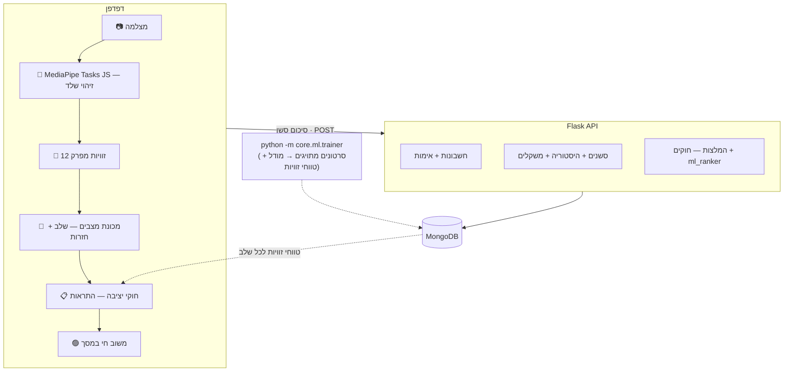

# Pose-IQ — מסמך סטטוס

> מסמך פנימי להכנה לפגישת חיתוך מצב עם המנחה · עודכן אוגוסט 2026
> (גרסה קודמת מיוני 2026 הייתה מבוססת על ארכיטקטורת Desktop/Postgres שכבר לא קיימת — המסמך הזה נכתב מחדש בהתאם למערכת הנוכחית)

Pose-IQ היא מערכת אימון כושר חכמה בזמן אמת, הפועלת כ**אפליקציית ווב** בדפדפן. המצלמה (מובנית/וובקאם) מצלמת את המתאמן, זיהוי הפוז רץ **בצד הלקוח** (בדפדפן, בלי לשדר וידאו לשרת), המערכת מזהה את שלב התרגיל, סופרת חזרות, נותנת משוב מיידי על טעויות יציבה, שומרת היסטוריית אימונים בענן ומפיקה המלצות מותאמות אישית — כולל מעקב משקלים והמלצות העמסה הדרגתית.

---

## 1. סקירה כללית וסטאק טכנולוגי

| תחום | טכנולוגיה |
|------|-----------|
| לקוח (ווב) | `React 19` + `Vite`, דו-לשוני (עברית/אנגלית), RTL מלא |
| זיהוי פוז בדפדפן | `MediaPipe Tasks JS` (`pose_landmarker_lite`, GPU) — רץ מקומית בלקוח |
| שרת API | `Python 3.12` + `Flask` |
| מסד נתונים | `MongoDB` |
| למידת מכונה | `scikit-learn` (Random Forest), `joblib` |
| אב-טיפוס Desktop (עדיין קיים) | `OpenCV` + `MediaPipe` (Python) — `core/pipeline.py`, הרצה מקומית עם חלון וידאו |
| בדיקות | `pytest`, 293 טסטים עוברים (`mongomock`, ללא תלות במסד אמיתי) |

**4 תרגילים נתמכים עם זיהוי פוז חי**: סקוואט, לאנג', כפיפת מרפקים (biceps curl), לחיצת כתפיים. (קטלוג ההמלצות הכללי כולל גם תרגילים נוספים כמו פלאנק — אך אלה מומלצים בלבד, בלי מעקב תנועה חי).

**שני מסלולי הרצה קיימים במקביל:**
- **ווב** (המסלול הפעיל/מפותח) — `frontend/` React, זיהוי פוז ב-`frontend/src/pose/` (MediaPipe Tasks JS), שומר סשנים דרך ה-API.
- **Desktop Python** (האב-טיפוס המקורי, עדיין עובד) — חלון `OpenCV`, `python -m core.pipeline <exercise> <user_id>`.
שני המסלולים חולקים את אותה לוגיקת זוויות/מכונת-מצבים/חוקים — ה-TS בצד הלקוח הוא פורט נאמן של הפייתון.

---

## 2. מבנה התיקיות והקבצים

**`api/` — שרת ה-API**

| קובץ | תפקיד |
|------|-------|
| `app.py` | Flask: הרשמה/התחברות, פרופיל, ציוני בריאות, קטלוג תרגילים, סשנים, היסטוריה, המלצות, דשבורד. |

**`core/pipeline.py`** — מריץ את המסלול ה-Desktop: מצלמה → MediaPipe → זוויות → מכונת מצבים → חוקי יציבה → HUD + TTS.

**`core/ml/` — למידת מכונה**

| קובץ | תפקיד |
|------|-------|
| `angles.py` | 12 זוויות מפרק בנרמול דו-ממדי — המרחב שהמודלים מאומנים עליו. |
| `extractor.py` | חילוץ פריימים מסרטון (`~/.pose-iq` cache, עוקף בעיית נתיב עברי). |
| `trainer.py` | אימון מסווג RandomForest לכל תרגיל מסרטונים מתויגים; כותב טווחי זוויות ל-Mongo. |
| `classifier.py` | חיזוי בזמן אמת + `DeltaTracker` למהירויות זוויתיות. |
| `smoother.py` | החלקה זמנית — הצבעת רוב + אילוץ מחזור-פאזות חוקי. |
| `reps.py` | מדד רמת-חזרה — התאמת עוגנים, recall/precision/F1. |
| `eval.py` | הערכה על סרטון held-out, כולל `--rep-tol`. |

**`core/exercise/` — מודל ולוגיקת מצב**

| קובץ | תפקיד |
|------|-------|
| `exercise_model.py` | טוען הגדרות תרגילים (מ-JSON או מ-Mongo כולל טווחי זוויות). |
| `exercise_state_machine.py` | זיהוי מעברי שלב וספירת חזרות. |
| `posture_rules.py` | מנוע חוקי יציבה — משווה זוויות בפועל מול טווחים. |

**`core/db/`** — חיבור MongoDB (`get_db()`, `MONGODB_URI`). קולקציות: `users`, `tokens` (TTL), `sessions`, `exercises`, `exercise_angles`.

**`core/recommendation/`**

| קובץ | תפקיד |
|------|-------|
| `catalog.py` | קטלוג תרגילים רחב (כולל תרגילים בלי מעקב חי, כמו פלאנק). |
| `recommender.py` | ציון-אישי מבוסס חוקים + תרחישי בריאות. |
| `ml_ranker.py` | רגרסיה ליניארית — מחליפה את הציון החוקי מ-20 סשנים ומעלה. |
| `overload.py` | כללי double-progression להמלצת משקל. |

**`frontend/`** — React+Vite, `src/i18n.tsx` (עברית/אנגלית בלי תלויות), `src/pose/` (MediaPipe Tasks JS + פורטים ל-TS של angles/state-machine/posture-rules).
**`mobile/`** — שלד Expo RN עם דאטה מדומה, **קפוא** (הוחלט: ווב ניצח, ראו סעיף 7).

**`data/`**: `exercises_seed.json` (הגדרות תרגילים, בלי טווחי זוויות), `labeled_vidz/` (JSON תיוג, ב-git), `videos/` (~כמה מאות MB, **לא** ב-git), `models/` (`phase_*.joblib`, **לא** ב-git — נוצרים מחדש מה-trainer).

**`tools/video_labeler.html`** — כלי תיוג עצמאי בדפדפן (בלי שרת) לסימון מעברי-פאזה בסרטונים ויצוא JSON בפורמט שה-trainer מצפה לו.

**`docs/filming-protocol-he.md`** — פרוטוקול צילום/תיוג מלא (זוויות מצלמה, מבנה סרטון, כללי גבול לתיוג).

---

## 3. זרימת המערכת (ארכיטקטורה)

הערה: אימון ה-ML הוא תהליך **אופליין** (לא בזמן ריצה) — מריצים אותו כשמצטבר דאטה חדש, והוא כותב גם את המודל (`phase_{ex}.joblib`) וגם את טווחי הזוויות לכל שלב ל-Mongo. שני המסלולים (ווב + Desktop) קוראים את אותם טווחים בזמן ריצה.

---

## 4. שכבת למידת המכונה (ML)

בניגוד לגרסה קודמת של מסמך זה — **יש כרגע רק סוג מודל אחד בפועל**: מסווג **Random Forest** לזיהוי **שלב התרגיל** (standing/descending/ascending וכו'), אחד לכל תרגיל. **זיהוי התרגיל עצמו נעשה ידנית** (המשתמש בוחר בממשק), לא ב-ML. **אין כרגע מודל לזיהוי איכות-ביצוע** — זה עדיין מבוסס-חוקים בלבד (ראו סעיף הבא); מסווג בינארי לאיכות מתוכנן לעתיד (סעיף 9) ברגע שיהיו קליפי "ביצוע שגוי".

**וקטור המאפיינים**: 12 זוויות מפרק (נרמול דו-ממדי) + 12 מהירויות זוויתיות (מעלות/שנייה, מנורמל לפי זמן). מאפיינים מחושבים באותו קוד באימון ובחיזוי כדי שלא ייווצר פער.

**מצב הדיוק הנוכחי** (אחרי סבב צילום ראשון — 27 סרטונים חדשים, 2 אנשים × 3 זוויות מצלמה × 4 תרגילים, + 3 קליפים בקצב מודגש ל-shoulder_press):

| תרגיל | frame-exact (raw) | boundary ±0.3s (מוחלק) | rep-level recall (מוחלק) |
|---|---|---|---|
| shoulder_press | 79% | 87% | 75% |
| lunge | 66% | 90% | 100% |
| biceps_curl | 81% | 82% | 100% |
| squat | 97%* | 97%* | 100%* |

*עבור squat: המספר ה"רשמי" שה-trainer מדפיס אוטומטית (מבחן על קובץ יחיד ישן ולא-אחיד מהאינטרנט) נמוך יותר (~54%) — אבחון מדוקדק (מבחנים מבודדים עם קבצים מוחזקים-בצד שונים) הראה שזה חולשה של קובצי-הבדיקה הישנים עצמם, לא של המודל: על קובץ חדש שצולם בפרוטוקול עקבי ולא נראה באימון, הדיוק 97%/100%. **נקודה טובה להצגה למנחה** — ממחישה תהליך אבחון שיטתי (rerun מבודד לכל תרגיל, לא רק קבלת המספר האוטומטי כמות שהוא).

**shoulder_press היה החולשה המרכזית בסבב הקודם (32% frame-exact) — הקליפים בקצב המודגש פתרו את הבעיה** (ירידה איטית שנראתה כמו עמידה סטטית). lunge ו-biceps_curl השתפרו גם הם, בעיקר ברמת-חזרה (100% אצל שניהם).

**מדד רמת-חזרה** (`core/ml/reps.py`): חזרה מעוגנת במעבר לפאזה האחרונה במחזור (נקודת המפנה); התאמת עוגנים אמת↔חיזוי בטווח ±0.5s. זה המדד המרכזי לגרף "דיוק כתלות בכמות דאטה" בדוח.

### מדוע גם חוקים וגם ML? (שאלה צפויה)

- **ה-ML** מזהה **באיזו פאזה** אתה נמצא — קלט חיוני, אבל לא אומר אם הביצוע *תקין*.
- **החוקים** (הסעיף הבא) בודקים אם הזוויות **בתוך הפאזה שזוהתה** נמצאות בטווח תקין, ונותנים משוב ספציפי ("יישר גב"). זה גם ה**בסיס לבטיחות** — עובד גם בלי דאטה.
- שילוב: ML לזיהוי חסין למצב, חוקים למשוב מוסבר ואכיפת בטיחות.

---

## 5. שכבת חוקי היציבה (לא ML)

`core/exercise/posture_rules.py` בודק כל פריים מול טווחים מותרים לכל מפרק. שני מקורות טווחים:

- **גלובליים, קשיחים** — למשל זווית גב מקסימלית לאורך כל התרגיל. מוגדרים ידנית ב-`data/exercises_seed.json`, **לא** נגזרים מדאטה, **לא** נדרסים על ידי ה-trainer.
- **ספציפיים לפאזה** — למשל טווח זווית ברך ב-descending. **כן נגזרים מדאטה**: `trainer.py` מודד אותם סטטיסטית מהסרטונים המתויגים וכותב ל-Mongo (`exercise_angles`) בכל הרצת אימון.

בשני המקרים, ההחלטה בזמן ריצה היא **בדיקת טווח פשוטה** (`value in [min, max]`) — לא מודל שני שמנבא "נכון/שגוי". כלומר: הטווחים עצמם מבוססי-דאטה, אבל מנגנון ההחלטה הוא חוקים דטרמיניסטיים.

---

## 6. שכבת מסד הנתונים (DB)

**MongoDB** — לא Postgres (הגרסה הקודמת של המסמך תיארה Postgres/SQLite; השכבה הזו הוחלפה במלואה). קולקציות: `users`, `tokens` (עם TTL אוטומטי לפקיעת טוקן), `sessions`, `exercises`, `exercise_angles`.

---

## 7. מה כבר עובד והושג

- זיהוי פוז חי **בדפדפן** (MediaPipe Tasks JS) — לא רק Desktop.
- 4 תרגילים, זיהוי שלב (RF, מספרי דיוק לעיל), ספירת חזרות, חוקי יציבה עם משוב מיידי.
- לקוח ווב דו-לשוני (עברית/אנגלית) מלא, RTL, מסכי בית/אימון/היסטוריה.
- אימות משתמשים (scrypt, שדרוג שקוף מ-sha256 ישן), פרופיל, ציוני בריאות.
- **מעקב משקלים + המלצות העמסה הדרגתית** (double-progression לפי ציון פורם) — פעיל, לא רק בתכנון.
- מנוע המלצות: חוקי תרחישי-בריאות + `ml_ranker.py` (רגרסיה ליניארית) מ-20 סשנים ומעלה.
- דשבורד עם ציון ממוצע, מגמות, המלצות תרגיל ומשקל.
- 293 טסטים עוברים (backend + frontend, CI מריץ אוטומטית).
- הכנת דיפלוי לענן: `Procfile` + gunicorn, CORS מבוסס משתני-סביבה, CI לטסטים.

---

## 8. החלטות שכבר התקבלו

### ווב מול React Native — **הוחלט: ווב**

זיהוי הפוז חייב לרוץ בצד הלקוח (אי אפשר לשדר מצלמה גולמית לשרת בזמן אמת), כך שההבדל האמיתי בין RN לווב הוא רק בלקוח. נבנה קליינט ווב מלא ועובד קצה-לקצה; שלד ה-RN (`mobile/`) הוקפא עם דאטה מדומה.

### מודל אישי ללמידת המשתמש

`core/recommendation/ml_ranker.py` — רגרסיה ליניארית על 11 מאפיינים (ציוני-פורם ומגמתם, השלמת-תרגיל, ותק, נורמליזציית בריאות וכו'), מטרה: ציון-שביעות-רצון מורכב (שיפור פורם + השלמה + חזרתיות + משוב מפורש). מתחיל לפעול אוטומטית מ-**20 סשנים** למשתמש; מתחת לזה — נופל בחזרה לחוקים (`recommender.py`).

---

## 9. מה עוד חסר — צעדים הבאים

- **דיפלוי בפועל לענן** — ההכנה מוכנה (Procfile/CORS/CI) אבל טרם בוצע: MongoDB Atlas, Render (API), Vercel (frontend).
- **קליפי ביצוע-שגוי (bad-form)** — עדיין לא צולמו. נדרשים למסווג בינארי לאיכות-ביצוע (הרחבה עתידית של סעיף 4).
- **בדיקת מצלמה חיה עם משתמש אמיתי** בסביבת production (אחרי הדיפלוי).
- **פלאנק** ותרגילים נוספים בקטלוג ההמלצות — עדיין בלי מעקב תנועה חי.

